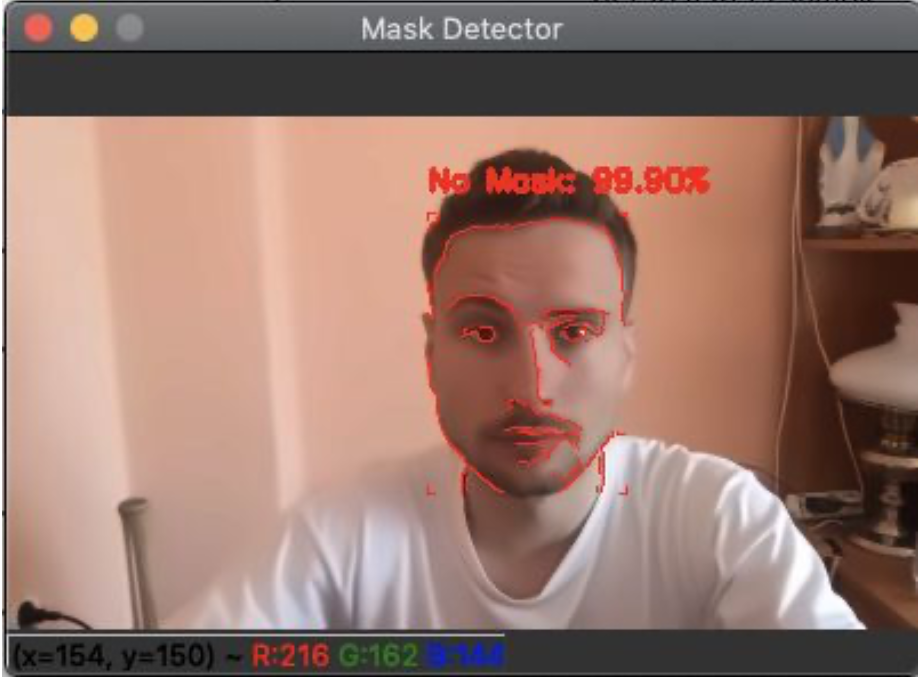
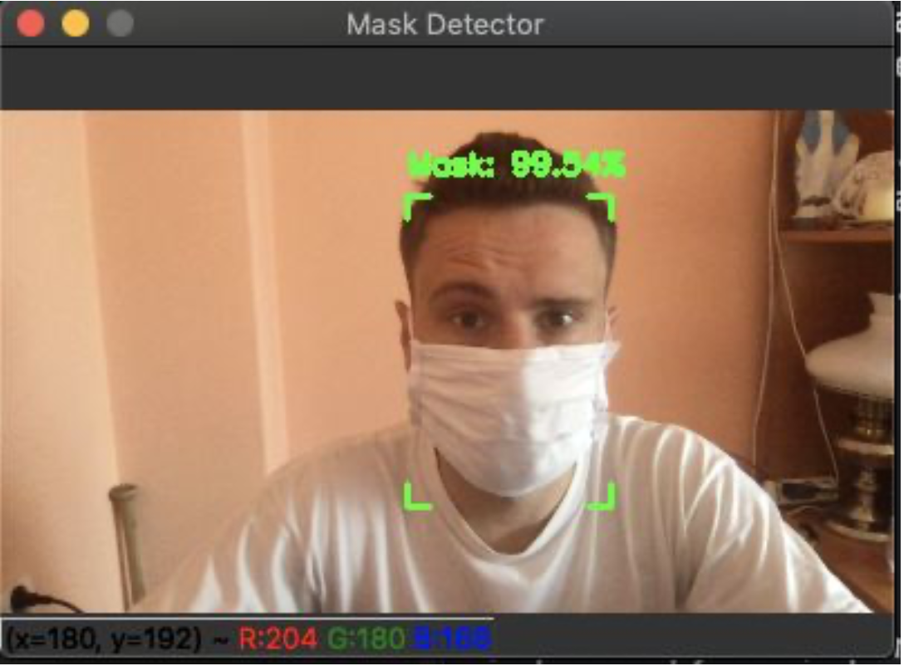

###Implementation of a neural network capable of detecting a face mask in real time.
## Implemented in python with tools such as tensorflow.keras and opencv.

Please read the documentation for details
	https://drive.google.com/file/d/13CU_rcgHCauQr4UoSHdgNET5N9WSgWXa/view?usp=sharing

Download
	DataSet
		https://github.com/prajnasb/observations/tree/master/experiements/data
	
	Face detection model
		https://github.com/thegopieffect/computer_vision/tree/master/CAFFE_DNN
		
		files:
			res10_300x300_ssd_iter_140000.caffemodel
			deploy.prototxt.txt
	
	Our Project Files:
		https://drive.google.com/drive/folders/1KlvvtoRUcN1c-iuAoQbk-zV_TFAlBYBl?usp=sharing
		
		files:
			detect_mask_video.py
			train_mask_detector.py

expected folders tree
	|- project
		|- dataset
			|- with_mask
			|- without_mask
			
		|- face_detector
			|- res10_300x300_ssd_iter_140000.caffemodel
			|- deploy.prototxt.txt
			
		|- detect_mask_video.py
		|- train_mask_detector.py

Installation
	pip install
		tensorflow
		opencv-python

		sklearn
		imutils
		PIL (pillow)

Usage
	python train_mask_detector.py -d [dataset] -m [output.model]
	python detect_mask_video.py -f [face_model] -m [mask.model] -c [float]

If any package can't install check if the path it tries to install to is not too long for windows

disable long name limit in windows
	HKEY_LOCAL_MACHINE\SYSTEM\CurrentControlSet\Control\FileSystem

